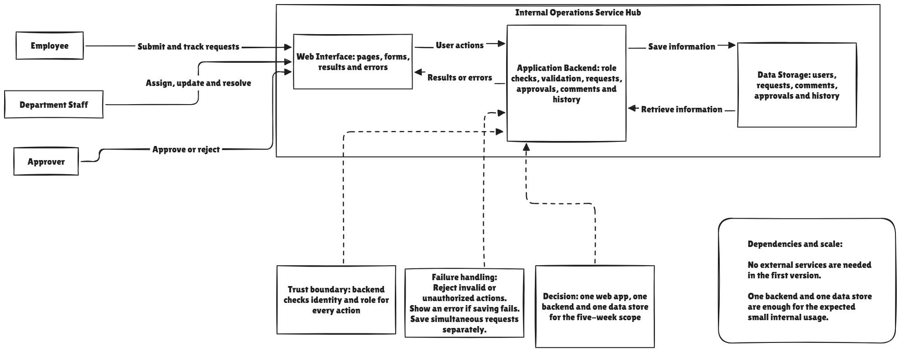

# Internal Operations Service Hub - Architecture

## 1. Purpose and Scope

The purpose of this architecture is to show the main parts of the Internal Operations Service Hub and how information moves between them.

The system will be used by three main actors:

* **Employee:** Submits requests, tracks their progress, and adds comments.
* **Department Staff:** Handles requests for their department, assigns requests, changes their status, and adds comments.
* **Approver:** Approves or rejects requests that require approval.

The first version includes login, request submission, assignment, status updates, approvals, comments, and request history.

It does not include email or SMS notifications, attachments, live chat, AI features, booking, advanced reports, external integrations, or a mobile application.

## 2. Components and Responsibilities

The system has three main components.

### Web Interface

The Web Interface contains the pages and forms used by the Employee, Department Staff, and Approver. It receives their actions and displays request information, results, and error messages.

### Application Backend

The Application Backend handles the main system rules. It checks the user’s identity and role, validates information, manages requests, assignments, statuses, approvals, and comments, and records important changes in the request history.

### Data Storage

Data Storage keeps the users, requests, comments, approvals, and request history. It communicates only with the Application Backend. The Web Interface cannot access it directly.

## 3. Important Data Flows

When an employee submits a request, the Web Interface sends the request information to the Application Backend. The backend checks the user and the required information. If everything is valid, it saves the request with the status `Submitted` and returns the result to the Web Interface.

When department staff assign or update a request, the backend checks that the request belongs to their department. It then saves the responsible staff member or the new status.

When an approver approves or rejects a request, the backend first checks that the user has the Approver role. The decision is then saved and shown to the employee and department staff.

When a comment, status, or approval is added or changed, the backend saves the information and records important changes in the request history.

## 4. Trust and Authorization

The Web Interface is outside the trusted part of the system because information sent by a user may be invalid or unauthorized. For this reason, the Application Backend must check every important action.

The main authorization rules are:

* Employees can only see requests they created.
* Department staff can only manage requests sent to their department.
* Only the responsible staff member can update an assigned request.
* Only approvers can approve or reject requests.
* Users must be allowed to access a request before viewing it or adding a comment.

These checks must happen in the backend, not only by hiding buttons in the Web Interface.

## 5. Failure Handling and Reliability

If required information is missing, the request should not be saved and the user should see a clear error message.

If a user tries to perform an unauthorized action, the backend should reject it without showing or changing protected information.

If saving fails, the system should show an error instead of showing a success message.

If two employees submit different requests at the same time, both requests should be saved separately without losing or mixing their information.

Saved requests, comments, approvals, and history should not be lost when another action fails.

## 6. Architecture Decisions

I chose one Web Interface, one Application Backend, and one Data Store because the project must be completed during the five-week academy. This structure is simple enough to develop and test while still separating the user interface, system rules, and stored information.

The backend is responsible for validation and authorization because the Web Interface alone cannot safely protect the information.

One central Data Store is enough for the expected small internal usage and will help keep requests, comments, approvals, and history consistent.

The first version does not use external services or microservices because they are not necessary for the main request process and would make the project more complicated.

## 7. Requirements Traceability

The architecture comes directly from the requirements in `product-spec.md`:

* The login and role requirements led to identity and role checks in the backend.
* The request-submission requirement led to the request flow from the Web Interface to the backend and Data Storage.
* The privacy requirements led to backend checks for request ownership and department access.
* The assignment requirement led to storing one responsible staff member for each assigned request.
* The status requirement led to the statuses `Submitted`, `In Progress`, and `Resolved`.
* The approval requirement led to a protected approval action for the Approver role.
* The comments requirement led to storing each comment with its author and creation date.
* The history requirement led to recording important status and approval changes.
* The reliability requirement led to validation, clear error handling, and separate handling of simultaneous requests.
* The five-week constraint led to using a simple architecture without external services or microservices.
